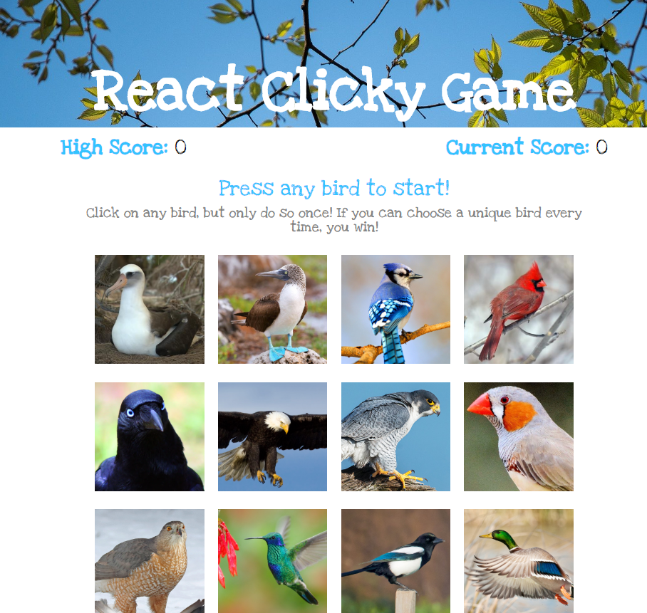

# React Bird Watcher

**Link to Live:** 

Example of utilizing React components to create a memory game (with birds, of course).

Used to show students how to break an app down into React components **and** how to use classes/states in React (since the cirriculum these days only briefly mentions classes and runs off with hooks and the like).

## Screenshot

